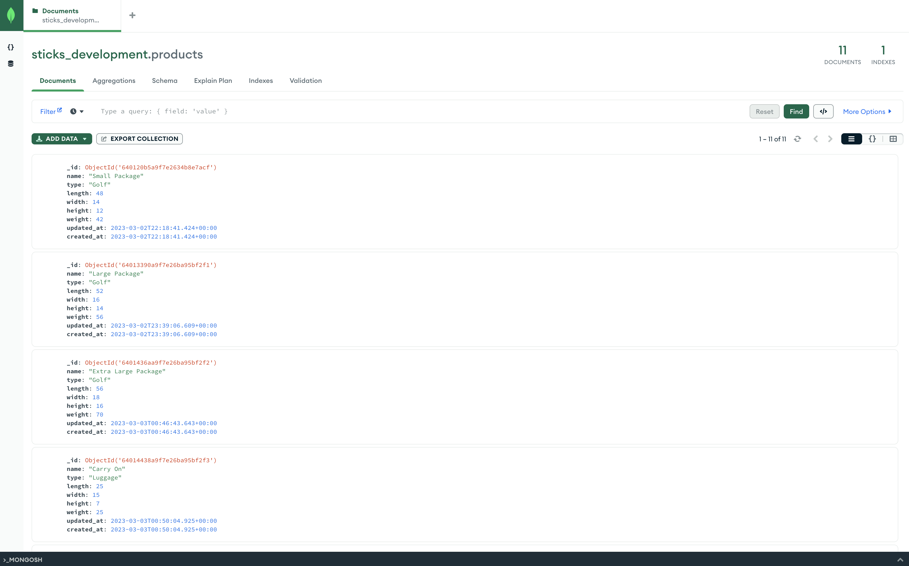

# README

## Project Links

[Repo Link](https://github.com/onomatopoetica/sticks)

## Table of Contents

1. [About The Project](#About-The-Project)
1. [Getting Started](#Getting-Started)
1. [Installation](#Installation)
1. [License](#License)

## Installation

#### Install Dependencies

- Github
- Ruby 3.0
- Rails 7.0.4.2
- Mongoid Database - MongoDB using [Mongoid Gem - tutorial link is for Ruby on Rails 7](https://www.mongodb.com/docs/mongoid/current/tutorials/getting-started-rails7/)

  - NOTE: carefully follow the instructions in the tutorial link above to ensure the database is set up properly and compatible with Rails 7.

* If you do not have a MongoDB account, sign up for free: [MongoDB](https://www.mongodb.com/try)

- Download Compass for MongoDB, an interactive tool for querying, optimizing, and analyzing your MongoDB data. Get key insights, drag and drop to build pipelines, and more.

* An example of Sticks DB in [MongoDB Compass](https://www.mongodb.com/products/compass) - the GUI for MondoDB: 

The Repository

- `git@github.com:onomatopoetica/sticks.git`
  Instructions for [cloning a GitHub repo](https://docs.github.com/en/repositories/creating-and-managing-repositories/cloning-a-repository).

#### _Return to [Table of Contents](#Table-of-Contents)_

## License

#### Distributed under the MIT License. See [License](https://choosealicense.com/licenses/mit/) for more information.
